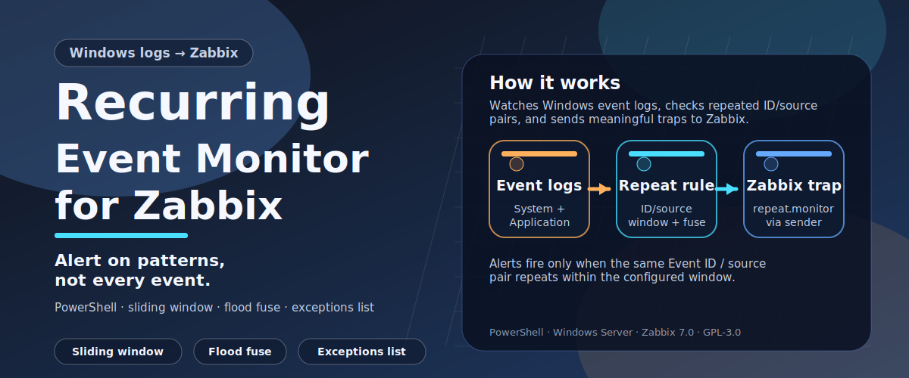

# Recurring Event Monitor for Zabbix



A **PowerShell** script that monitors the Windows **System** and **Application**
event logs for **recurring errors and warnings** and forwards trap notifications
to a **Zabbix server** via `zabbix_sender`. Runs on monitored Windows hosts
triggered by the Zabbix agent `system.run` item on a configurable schedule
(typically every hour).

Unlike Zabbix's built-in event log monitoring — which fires on every matching
entry — this script fires only when the **same Event ID / source combination
recurs within a configurable sliding time window**, cutting noise while reliably
catching patterns that indicate real problems.

**Key capabilities:**
- Configurable sliding window: alert only after ≥ N occurrences within M minutes
- Flood-protection fuse: one notification per cooldown period, no alert storms
- Per-event exceptions list: permanently silence known-noisy sources
- Incremental processing: persists state between runs; processes only new events
- Ready-to-import **Zabbix 7.0 template** with trigger and two items included

## How It Works

The script maintains a per-host state between runs using two cache files in
`%SystemRoot%\Temp`. On every execution it:

1. Reads the `System` and `Application` event logs (configurable) for the period
   since the last run.
2. Skips events whose `EventID:SourceName` pair is listed in `exceptions.conf`.
3. For each remaining event, maintains a **sliding time window** of its timestamps.
4. When the same `EventID:SourceName` pair occurs **≥ CompareCount times within
   CompareInterval minutes**, a Zabbix trap is sent to the `repeat.monitor` item
   via `zabbix_sender`.
5. A **flood-protection fuse** (FloodFuse) suppresses further alerts for the same
   pair for a configurable cooldown period (default: 24 hours).

The Zabbix agent triggers the script through a `system.run` passive-check item
with the `nowait` option—the agent starts PowerShell in the background and
immediately returns `1` to Zabbix without waiting for the script to finish.

---

## Minimum Requirements

| Component | Version |
|---|---|
| Windows | Server 2012 R2 / Windows 8.1 or later |
| PowerShell | 5.1 or later |
| Zabbix Agent | 4.0 or later (passive mode) |
| Zabbix Server | 6.0 or later (template requires 7.0 for YAML import) |

The `zabbix_sender` executable must be present on every monitored host. It is
included in the standard Zabbix agent installer package.

---

## Files

```
recurring-event-monitor-for-zabbix/
├── recurring-event-monitor.ps1            # Main script
├── config.psd1                            # Script configuration (edit this)
├── exceptions.conf                        # Suppressed events (edit this)
├── recurring-event-monitor-template.yaml  # Zabbix 7.0 template
├── README.md
└── LICENSE
```

---

## Installation

### 1. Place files in a shared network folder (recommended)

**Do not copy the files to each individual machine.** In an environment with
hundreds or thousands of monitored hosts, per-machine copies are impractical to
keep up to date. A change to `config.psd1` or `exceptions.conf` would require
touching every host.

Instead, place the files in a **shared network folder** accessible to the
`SYSTEM` account on all domain-joined hosts. Updating the script or its
configuration files in one place takes effect on every host at the next
scheduled run — no per-machine action required.

The **NETLOGON** share is ideal: every domain member has read access to it via
the `SYSTEM` account by default:

```
\\domain\netlogon\recurring-event-monitor\
```

Copy `recurring-event-monitor.ps1`, `config.psd1`, and `exceptions.conf` into
that directory and set the `{$REM.SCRIPT_PATH}` macro in the Zabbix template to
the same UNC path (see [Configuring the script path macro](#configuring-the-script-path-macro)).

> **Workgroup / non-domain environments:** use a local path such as
> `C:\Scripts\recurring-event-monitor\` and deploy files via your preferred
> method (Group Policy, Ansible, PDQ Deploy, etc.).

### 2. Edit `config.psd1`

Open `config.psd1` and set at minimum:

| Key | Description |
|---|---|
| `ZabbixSenderPath` | Full path to `zabbix_sender.exe` on the monitored host |
| `ZabbixConfigPath` | Full path to the Zabbix agent `.conf` file; `zabbix_sender` reads the `Server=` address from this file automatically |

Adjust `CompareInterval`, `CompareCount`, and `FloodFuse` to match the noise
level and alert cadence of your environment (see the inline comments in
`config.psd1` for details).

### 3. Allow `system.run` in the Zabbix agent configuration

The agent must have `system.run` enabled. Add or verify the following line in
`zabbix_agentd.win.conf`:

```ini
AllowKey=system.run[*]
```

Restart the Zabbix Agent service after the change.

### 4. Test manually

Run the script once in an elevated PowerShell session to verify it works:

```powershell
# Using a UNC path (recommended)
powershell -NoProfile -ExecutionPolicy Bypass -File "\\domain\netlogon\recurring-event-monitor\recurring-event-monitor.ps1"

# Or using a local path (non-domain fallback)
powershell -NoProfile -ExecutionPolicy Bypass -File "C:\Scripts\recurring-event-monitor\recurring-event-monitor.ps1"
```

Check `%SystemRoot%\Temp\Loghash.xml` and `Config.cache` to confirm state
files were written.

---

## Zabbix Template

### Importing the template

1. Log in to the Zabbix web interface.
2. Go to **Configuration → Templates**.
3. Click **Import** and select `recurring-event-monitor-template.yaml`.
4. Accept the default options and click **Import**.

The template creates the group **Templates/Windows** if it does not already exist.

### Linking the template to hosts

1. Go to **Configuration → Hosts** and open each Windows host you want to monitor.
2. On the **Templates** tab, click **Add** and select **Recurring Event Monitor**.
3. Click **Update**.

### Configuring the script path macro

After linking the template, set the `{$REM.SCRIPT_PATH}` macro to the
directory containing the script files.

**For shared-folder deployments (recommended):** override the macro once at the
template level — all linked hosts inherit it automatically:

1. Open **Configuration → Templates → Recurring Event Monitor → Macros**.
2. Set `{$REM.SCRIPT_PATH}` to the UNC path, e.g.
   `\\domain\netlogon\recurring-event-monitor` (no trailing backslash).

**For per-host local paths:** override at the host level instead:

1. Open **Configuration → Hosts → \<host\> → Macros**.
2. Add `{$REM.SCRIPT_PATH}` with the local path for that host.

#### Adjusting the run interval

The macro `{$REM.RUN_INTERVAL}` controls how often Zabbix polls the agent to
trigger the script. The default is `1h`. Override this macro at the host level
if a different schedule is needed.

---

## Zabbix Items Created by the Template

| Item name | Key | Type | Purpose |
|---|---|---|---|
| Recurring Event Monitor: Run Script | `system.run[...,nowait]` | Zabbix Agent (passive) | Triggers the script on schedule |
| Recurring Event Monitor: Alert Trap | `repeat.monitor` | Zabbix Trapper | Receives alert data from `zabbix_sender` |

---

## Configuring the Zabbix Trap Receiver

The script sends traps using `zabbix_sender`, which connects to the Zabbix server
on **TCP port 10051**. The server listens for incoming trapper data using dedicated
trapper processes.

### Zabbix server side

The default Zabbix server configuration is sufficient for most deployments. The
relevant parameters in `zabbix_server.conf` are:

| Parameter | Default | Description |
|---|---|---|
| `StartTrappers` | 5 | Number of trapper processes. Increase if traps arrive faster than they are processed. |
| `TrapperTimeout` | 300 | Seconds a trapper process waits for data from a single connection. |

Verify these settings on the Zabbix server:

```bash
grep -E "StartTrappers|TrapperTimeout" /etc/zabbix/zabbix_server.conf
```

### Firewall rules

The monitored Windows host must be able to reach the Zabbix server on **TCP 10051**:

```powershell
# Test connectivity from the monitored host (PowerShell)
Test-NetConnection -ComputerName <zabbix-server> -Port 10051
```

If a proxy is used, `zabbix_sender` sends to the proxy on port 10051 and the
proxy forwards to the server. The target address is read from the `Server=`
directive in the agent config file referenced by `ZabbixConfigPath` in
`config.psd1`.

### Verifying that traps are being accepted

After triggering the script manually, check the Zabbix server log for incoming
trapper connections:

```bash
grep -i "trapper" /var/log/zabbix/zabbix_server.log | tail -20
```

You can also verify by checking **Monitoring → Latest data** for the monitored
host and filtering by `repeat.monitor`.

---

## Managing the Exceptions List

`exceptions.conf` lists event `EventID:SourceName` pairs that are permanently
silenced, even if they occur repeatedly.

### Format

```
# This is a comment – ignored entirely
EventID:SourceName          # optional inline comment
0:SomeApplication           # EventID 0 silences ALL events from this source
```

Rules:
- Matching is **case-insensitive**.
- Lines starting with `#` are comments.
- Inline `#` comments are stripped before the line is processed.
- Blank lines are ignored.
- Using `0` as the EventID suppresses all events from the specified source
  regardless of their numeric ID.
- Prefix a line with `#` to temporarily disable an exception.

### Adding a new exception

Open `exceptions.conf` in any text editor and add the entry:

```
1234:My Noisy Application   # Added 2025-06-01 – waiting for vendor fix
```

The change takes effect on the next script run. No Zabbix restart is needed.

### Purging stale entries from the cache

If you remove an entry from `exceptions.conf`, the event key will be absent from
the in-memory hash but may still be in `%SystemRoot%\Temp\Loghash.xml` (the
persisted state). The script automatically removes matching keys from the hash on
startup, so no manual cache cleanup is required.

---

## Troubleshooting

| Symptom | Likely cause | Solution |
|---|---|---|
| `repeat.monitor` never receives data | `AllowKey=system.run[*]` missing in agent config | Add `AllowKey=system.run[*]` and restart the agent |
| Script runs but sends no traps | All events are in `exceptions.conf`, or no event meets the threshold | Lower `CompareCount`, check `exceptions.conf` |
| `zabbix_sender` exits with "connection refused" | Port 10051 blocked or wrong `Server=` in the Zabbix agent config | Check firewall; verify `Server=` in `zabbix_agentd.win.conf` |
| Zabbix shows "Not supported" on the Run Script item | `system.run` disabled or execution policy too strict | Enable `AllowKey=system.run[*]`; check PowerShell execution policy |
| Alert message contains garbled characters | Encoding mismatch in event source | The script applies a Windows-1251 re-encoding heuristic; for sources that are properly UTF-8 this can produce minor artefacts |
| Cache grows too large | Long-running hosts with many unique event sources | Delete `%SystemRoot%\Temp\Loghash.xml`; the script will recreate it cleanly |

---

## License

This project is licensed under the **GNU General Public License v3.0**.
See the [LICENSE](LICENSE) file for details.
